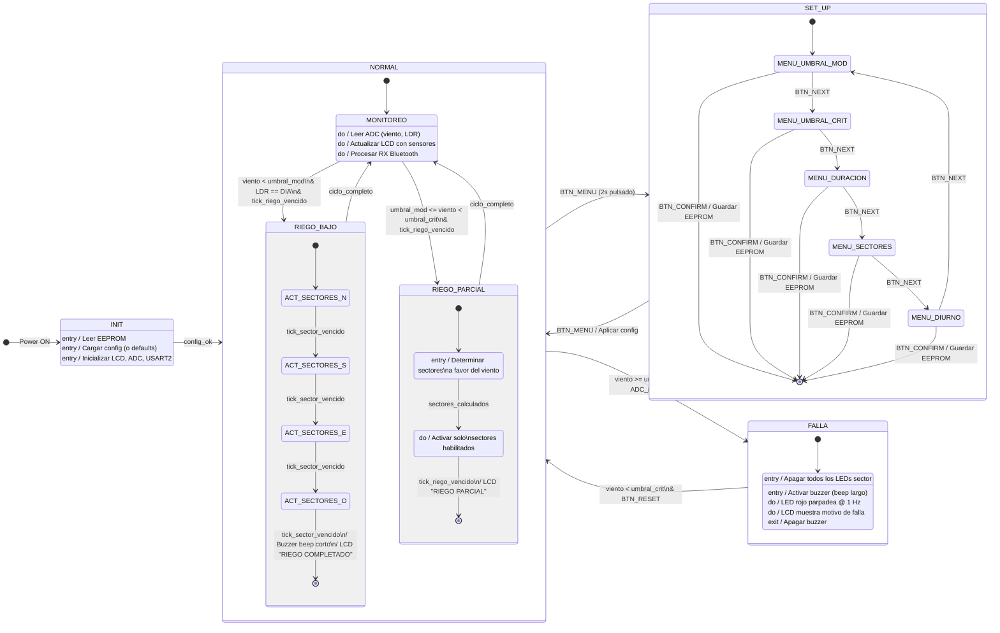

# **Sistema de Riego Automático con Gestión de Viento (SRAGV) - INFORME FINAL**

**Autores:** Garcia Caneva Leandro, Vargas Joaquin, Molina Aban Florencia  
**Padrones:** 1034756, 104323, 104153  
**Fecha:** 1er cuatrimestre 2026

---

## 0.1 Objetivo del Trabajo

El objetivo de este trabajo es diseñar e implementar un sistema embebido de riego automático capaz de tomar decisiones inteligentes en función del estado del viento. La idea central consiste en que el sistema **modifique o bloquee el riego según la velocidad y dirección del viento**, dado que en condiciones de viento intenso el agua se dispersa fuera de la zona de cultivo, haciendo el proceso de riego ineficiente o directamente perjudicial para el cultivo.

El sistema gestiona cuatro sectores de riego independientes representados por LEDs (Norte, Sur, Este y Oeste) y tres modos de operación diferenciados:

*   **Viento bajo o nulo:** se activan en secuencia todos los sectores habilitados por el usuario.
*   **Viento moderado:** se activan únicamente los sectores a favor del viento para evitar el desperdicio en zonas expuestas.
*   **Viento crítico → Modo FALLA:** el riego se suspende completamente y se activa una alarma sonora y visual.

Como resultado esperado se obtiene un prototipo funcional que demuestra de forma clara los tres modos de operación, implementando lectura de sensores analógicos por ADC con DMA, comunicación remota vía Bluetooth, persistencia de configuración en EEPROM externa y una arquitectura de software Bare Metal Event-Triggered con código estrictamente no bloqueante.

---

## 0.2 Motivaciones

Argentina se destaca a nivel mundial como un actor clave en la producción agrícola, siendo la generación eficiente de alimentos una prioridad estratégica para el país. Sin embargo, la optimización del uso de los recursos hídricos en los sistemas de producción locales representa un desafío crítico que aún no ha sido resuelto de manera masiva.

En regiones de alta productividad agrícola y características geográficas particulares —como la **Patagonia argentina**— la presencia de vientos intensos y constantes se convierte en un factor adverso determinante para el riego por aspersión tradicional. Fenómenos como el **viento zonda** o las rachas típicas de las mesetas patagónicas pueden superar los 80 km/h con facilidad, provocando la **"deriva"** del agua: el chorro de riego es desviado de las zonas objetivo por la acción del viento, el agua se evapora antes de llegar al suelo y los nutrientes son lixiviados fuera de la parcela de cultivo. Todo ello genera:

*   **Pérdidas económicas significativas** para productores que ya operan con márgenes ajustados.
*   **Desperdicio severo del recurso hídrico**, en zonas que padecen restricciones hídricas severas.
*   **Daño fitosanitario**, al mojar follaje en condiciones de viento que luego favorecen la proliferación de hongos.

En este contexto, un sistema de riego inteligente que incorpore el viento como variable de decisión tiene aplicación directa y relevancia real para el sector agropecuario nacional. El SRAGV propone una solución de **bajo costo**, construida con componentes accesibles en el mercado local, que puede escalar desde un prototipo educativo hasta un módulo de control real para instalaciones de pequeña y mediana escala.

---

## 1. Hardware Obligatorio & Adicional

El sistema se basa en la placa de desarrollo STM32 y diversos periféricos para censado y actuación:

**Hardware Obligatorio:**
*   **Placa de desarrollo:** NUCLEO-F103RB (ARM Cortex-M3).
*   **Interfaz de usuario visual:** Display LCD 16x2 alfanumérico. Se utiliza en modo de 4 bits, conectado a los pines PC4 a PC9.
*   **Interfaz de usuario física:** 2 botones pulsadores (para navegación e ingreso en el menú interactivo).

**Hardware Adicional:**
*   **Módulo de Comunicación Remota:** Módulo Bluetooth HM-10 (UART).
*   **Sensores Analógicos:** 
    *   Joystick analógico (o dos potenciómetros) para emular la velocidad (eje X) y la dirección del viento (eje Y).
    *   Sensor LDR (fotocélula) para detectar el nivel de luminosidad ambiente.
*   **Actuadores Visuales y Sonoros:** 
    *   4 LEDs indicadores para los sectores de riego (Norte, Sur, Este, Oeste).
    *   2 LEDs de estado (verde para riego activo, rojo para falla).
    *   1 Buzzer activo para alertas sonoras.

---

## 2. Programación Obligatoria & Adicional

El firmware del sistema se desarrolló bajo el paradigma **Bare Metal Event-Triggered**, con código estrictamente no bloqueante estructurado modularmente:

**Programación Obligatoria:**
*   **Máquinas de Estados Finitos (FSM):** Arquitectura principal del programa dividida en estados bien definidos (`NORMAL`, `SET_UP`, `FALLA`) para coordinar las lecturas y el control de los actuadores sin bloqueos.
*   **GPIO:** Configuración y manejo de entradas (botones con antirrebote por software) y salidas (control de LEDs y buzzer).
*   **Soft RTC (SysTick):** Base de tiempos del sistema a partir de interrupciones del SysTick cada 1 ms, utilizado para temporización de tareas no bloqueantes y control de duración de riego.

**Programación Adicional:**
*   **ADC con DMA:** Lectura periódica de los tres canales analógicos (dos para el joystick y uno para la LDR). Se utiliza acceso directo a memoria (DMA) para realizar las conversiones de manera automática y no bloqueante.
*   **I2C (Inter-Integrated Circuit):** Comunicación bidireccional utilizada para interactuar con la EEPROM externa (AT24C02) para el almacenamiento no volátil de la configuración de usuario.
*   **USART2:** Protocolo serie utilizado para la comunicación asincrónica con el módulo Bluetooth HM-10, permitiendo la configuración remota y monitoreo desde una aplicación móvil.

---

## 3. Pruebas de Integración

En esta sección se detalla la prueba de integración final, validando el correcto funcionamiento en conjunto de todos los módulos del firmware y periféricos del hardware según los casos de uso definidos (Riego completo, Riego parcial, y Modo de configuración).

**Link al Video:**
[COMPLETAR: Pegar enlace al video de demostración acá]

---

## 4. Esquema Eléctrico y Vistas de Cableado

A continuación se presenta el conexionado final de los componentes.

**Esquema Eléctrico:**
[COMPLETAR: Pegar captura del esquema eléctrico (ej. Kicad/Proteus) acá]

**Vista de Cableado (Prototipo Físico):**
[COMPLETAR: Pegar foto del conexionado final de la placa acá]

---

## 5. Descripción del Comportamiento

El comportamiento del sistema es gestionado a través de una Máquina de Estados Finitos (FSM) que centraliza la lógica de control en tres modos de operación principales:

*   **Modo NORMAL:** Es el estado por defecto. El sistema monitorea de manera continua los sensores a través del ADC. Basándose en la velocidad y dirección del viento leídas, el sistema decide si:
    *   Activar todos los sectores secuencialmente (viento bajo/nulo).
    *   Activar solo los sectores a favor del viento (viento moderado).
    
    Si la luminosidad indica horario nocturno y la configuración lo requiere, el riego automático se inhibe.
    
*   **Modo SET_UP:** El sistema ingresa a este modo mediante la pulsación prolongada del botón de menú. En este estado se suspende el riego automático y se presenta un menú interactivo en el display LCD. El usuario puede modificar los umbrales de viento (moderado y crítico), habilitar/deshabilitar sectores y establecer el tiempo de riego por sector. Al confirmar, los datos son persistidos en la memoria EEPROM vía I2C.

*   **Modo FALLA:** El sistema transita a este estado de emergencia cuando la lectura del viento supera el umbral crítico configurado o se detecta una lectura inválida (saturada o nula) en los sensores de viento. Se aborta inmediatamente cualquier ciclo de riego en curso, se inhiben todos los LEDs de sector, se enciende el LED rojo intermitente de forma no bloqueante y se activa la alarma mediante el buzzer, mostrando el motivo en el LCD.

### 5.1 Diagrama de Estados (Statechart)

El siguiente diagrama representa la Máquina de Estados Finitos (FSM) principal del SRAGV, modelada al estilo de los diagramas de statechart de ITEMIS YAKINDU/SCT. Cada estado encapsula su comportamiento de entrada (`entry`), ejecución continua (`do`) y salida (`exit`), y las transiciones se etiquetan con el evento o condición de guarda que las dispara.

<em>Figura 5.1: Diagrama de estados (Statechart) del SRAGV — FSM principal</em>

---

## 6. Salida (Console & Build Analyzer)

Reporte del uso de memoria generado tras la compilación del firmware.

**Build Analyzer (Tamaños en bytes):**
*   `text` (Código y constantes en Flash): [COMPLETAR: Pegar tamaño acá] bytes
*   `data` (Variables globales inicializadas): [COMPLETAR: Pegar tamaño acá] bytes
*   `bss` (Variables globales sin inicializar): [COMPLETAR: Pegar tamaño acá] bytes

**Regiones de Memoria:**
*   **RAM:** [COMPLETAR: Pegar uso en bytes] bytes ( [COMPLETAR: Pegar %] % )
*   **FLASH:** [COMPLETAR: Pegar uso en bytes] bytes ( [COMPLETAR: Pegar %] % )

[COMPLETAR: Pegar captura del Build Analyzer acá]

---

## 7. Medición de Tiempos (WCET)

Se han analizado las tareas y rutinas principales en el peor de los casos (Worst-Case Execution Time) para garantizar el cumplimiento de los requerimientos de tiempo real de la arquitectura (cada vuelta del super-loop debe demorar menos de 1 ms).

| Tarea / Función | Tiempo de ejecución (WCET) |
| :--- | :--- |
| `ADC_Read_DMA_Callback()` | [COMPLETAR: Tiempo en µs] |
| `FSM_Update_State()` | [COMPLETAR: Tiempo en µs] |
| `LCD_Update_Display()` | [COMPLETAR: Tiempo en µs] |
| `EEPROM_Write_Config()` | [COMPLETAR: Tiempo en µs] |
| `Bluetooth_Process_Rx()` | [COMPLETAR: Tiempo en µs] |

---

## 8. Factor de Uso (U)

El factor de uso o utilización de la CPU se define a partir de la sumatoria de la relación entre el tiempo de ejecución en el peor de los casos ($C_i$) y el período de ejecución o de interrupción ($T_i$) de cada tarea/evento en el sistema:

$$U = \sum \frac{C_i}{T_i} = \frac{C_1}{T_1} + \frac{C_2}{T_2} + \dots + \frac{C_n}{T_n}$$

**Factor de Uso (U) calculado:** [COMPLETAR: Pegar resultado numérico de U acá] %

---

## 9. Medición y Análisis de Consumo

El sistema puede ser alimentado con distintas tensiones y puede ingresar en modo de bajo consumo (Sleep Mode) ante un tiempo preestablecido de inactividad de riegos y comunicaciones.

| Condición de Alimentación | Modo de Trabajo | Consumo Medido (mA) | Observaciones |
| :--- | :--- | :--- | :--- |
| 3.3V | Normal (Sin bajo consumo) | [COMPLETAR] | Sistema activo, todos los periféricos encendidos evaluando condiciones. |
| 3.3V | Sleep (Bajo consumo) | [COMPLETAR] | CPU en Sleep, interrupciones habilitadas. Esperando Wake-Up. |
| 5V | Normal (Sin bajo consumo) | [COMPLETAR] | Sistema activo, alimentado desde pin de 5V. |
| 5V | Sleep (Bajo consumo) | [COMPLETAR] | CPU en Sleep, alimentado desde pin de 5V. |

[COMPLETAR: Pegar capturas del osciloscopio o fotos del miliamperímetro acá]
