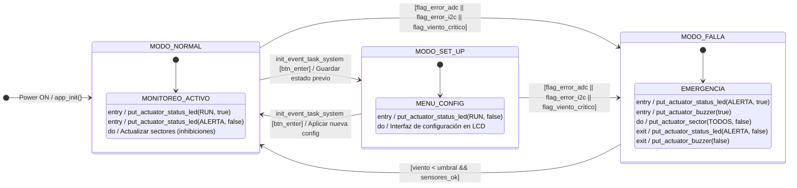

**UNIVERSIDAD DE BUENOS AIRES**  
**Facultad de Ingeniería**  
**Sistemas Embebidos**  

# Sistema de Riego Automático con Gestión de Viento (SRAGV)  
**Memoria Técnica y Código - INFORME FINAL**

## Autores
Garcia Caneva Leandro — Padrón 1034756  
Vargas Joaquin — Padrón 104323  
Molina Aban Florencia — Padrón 104153  

**Fecha:** 1er cuatrimestre 2026  

---

## Resumen

Se desarrolló un sistema embebido de riego automático (SRAGV) capaz de modificar o bloquear los ciclos de riego en función de la velocidad y dirección del viento.
El hardware se implementó en una NUCLEO-F103RB integrando sensores analógicos (emulados por joystick y potenciómetros) y sensores de luz (LDR), junto con comunicación Bluetooth (módulo HM-10) y memoria no volátil (EEPROM AT24C02). El firmware sigue una arquitectura *Bare Metal Event-Triggered* no bloqueante con una máquina de estados para la gestión de Modos de Operación (NORMAL, SET_UP, FALLA).

Esta memoria documenta los requisitos, el diseño del sistema, la implementación del firmware y hardware, junto con los ensayos realizados y el estado final.

---

# Índice General

- [Capítulo 1: Introducción general](#capítulo-1-introducción-general)
  - [1.1 Análisis de necesidad y objetivo](#11-análisis-de-necesidad-y-objetivo)
  - [1.2 Comparación con otras soluciones similares disponibles](#12-comparación-con-otras-soluciones-similares-disponibles)
  - [1.3 Productos comerciales disponibles](#13-productos-comerciales-disponibles)
  - [1.4 Comparación con el prototipo desarrollado](#14-comparación-con-el-prototipo-desarrollado)
  - [1.5 Alcance del prototipo](#15-alcance-del-prototipo)
- [Capítulo 2: Introducción específica](#capítulo-2-introducción-específica)
  - [2.1 Detalle de cambios de requisitos durante la realización del trabajo y requisitos del sistema](#21-detalle-de-cambios-de-requisitos-durante-la-realización-del-trabajo-y-requisitos-del-sistema)
  - [2.2 Casos de uso](#22-casos-de-uso)
- [Capítulo 3: Diseño e implementación](#capítulo-3-diseño-e-implementación)
  - [3.1 Arquitectura general](#31-arquitectura-general)
  - [3.2 Diseño de hardware](#32-diseño-de-hardware)
  - [3.3 Descripción de la máquina de estados implementada](#33-descripción-de-la-máquina-de-estados-implementada)
    - [3.3.1 Máquinas de estado](#331-máquinas-de-estado)
  - [3.4 Diseño de firmware](#34-diseño-de-firmware)
- [Capítulo 4: Ensayos y resultados](#capítulo-4-ensayos-y-resultados)
  - [4.1 Pruebas de integración](#41-pruebas-de-integración)
  - [4.2 Salida (Console & Build Analyzer)](#42-salida-console--build-analyzer)
  - [4.3 Medición de Tiempos (WCET)](#43-medición-de-tiempos-wcet)
  - [4.4 Factor de Uso (U)](#44-factor-de-uso-u)
  - [4.5 Medición y Análisis de Consumo](#45-medición-y-análisis-de-consumo)
- [Capítulo 5: Conclusiones](#capítulo-5-conclusiones)
  - [5.1 Resultados obtenidos](#51-resultados-obtenidos)
  - [5.2 Lecciones aprendidas](#52-lecciones-aprendidas)
  - [5.3 Próximos pasos](#53-próximos-pasos)
- [Capítulo 6: Uso de herramientas de IA](#capítulo-6-uso-de-herramientas-de-ia)
- [Capítulo 7: Bibliografía y referencias](#capítulo-7-bibliografía-y-referencias)

---

# Capítulo 1: Introducción general

## 1.1 Análisis de necesidad y objetivo

Argentina se destaca a nivel mundial como un actor clave en la producción agrícola. Sin embargo, la optimización del uso de los recursos hídricos representa un desafío crítico. En regiones de alta productividad o con características geográficas particulares, como la Patagonia argentina, los vientos intensos y constantes afectan negativamente al riego por aspersión. Fenómenos como el viento zonda o las rachas patagónicas provocan la "deriva" del agua (desviando el riego de la zona objetivo) y el aumento de la evaporación, lo que resulta en pérdidas económicas, desperdicio hídrico y daños fitosanitarios al cultivo.

El objetivo de este trabajo es diseñar e implementar un sistema embebido de riego automático (SRAGV) capaz de tomar decisiones inteligentes en función del estado del viento. El sistema modifica o bloquea el riego (activando/desactivando sectores específicos) según la velocidad y dirección del viento.

## 1.2 Comparación con otras soluciones similares disponibles

Durante el diseño del proyecto, se evaluaron distintas alternativas de integración considerando disponibilidad de hardware, viabilidad técnica, funcionalidad, tiempo de implementación y costo:
1. **Riego basado solo en viento:** Un sistema básico que decide regar o suspender.
2. **Riego con viento y fotosensor (LDR):** Agrega la condición de horario diurno/nocturno, enriqueciendo la lógica de control.
3. **Riego con viento, fotosensor y sensor de humedad de suelo:** Es la solución más completa pero demanda más tiempo de integración y calibración.

Se optó por la alternativa intermedia (viento + fotosensor) para asegurar un equilibrio entre funcionalidad y viabilidad técnica dentro del plazo de desarrollo, permitiendo suspender el riego automático si se está en un horario donde la luz ambiente no es favorable y el viento es contraproducente.

## 1.3 Productos comerciales disponibles

En el mercado agrícola existen productos que abordan la automatización del riego, pero suelen polarizarse en dos segmentos:

1. **Controladores de riego básicos/temporizados (Timers):** Son económicos y populares, pero operan exclusivamente bajo lógica de reloj (Soft RTC). No tienen retroalimentación del clima, regando aunque llueva o haya temporal de viento.
2. **Controladores IoT o sistemas SCADA avanzados:** Equipos de marcas líderes (como Hunter o Rain Bird) que se conectan a estaciones meteorológicas y servidores web. Son muy costosos, dependientes de conectividad Wi-Fi o redes 4G/LTE y su instalación técnica puede resultar restrictiva para pequeños productores.

## 1.4 Comparación con el prototipo desarrollado

El **SRAGV** propone una solución intermedia e innovadora. A diferencia de los temporizadores básicos, introduce lógica de control dinámica y sectorizada basada en sensores locales sin depender de redes de internet. 
Frente a los sistemas IoT de alta gama, el SRAGV ofrece **tecnología de bajo costo** y fácil implementación usando microcontroladores estándares (STM32). Adicionalmente, cuenta con conectividad Bluetooth local, que permite configurar los umbrales de viento y los sectores directamente desde un smartphone sin exponer el equipo a internet ni requerir infraestructura de red costosa.

## 1.5 Alcance del prototipo

El sistema gestiona cuatro sectores de riego independientes (Norte, Sur, Este y Oeste) representados por LEDs y tres modos de operación diferenciados:
- **Viento bajo o nulo:** se activan en secuencia todos los sectores habilitados.
- **Viento moderado:** se activan únicamente los sectores a favor del viento.
- **Viento crítico (Modo FALLA):** el riego se suspende y se activa una alarma sonora/visual.

Para fines de desarrollo físico, los sensores ambientales se emulan:
- Velocidad y dirección del viento mediante un **joystick analógico**.
- Luz ambiental usando una **fotocélula LDR**.
- El estado y la gestión remota vía **módulo Bluetooth HM-10**.

---

# Capítulo 2: Introducción específica

## 2.1 Detalle de cambios de requisitos durante la realización del trabajo y requisitos del sistema

A lo largo del proyecto, los requisitos originales se mantuvieron en gran medida, adaptándose los métodos de sensado a la viabilidad del prototipo en banco de trabajo (sustituyendo el anemómetro y la veleta real por emulación con joystick/potenciómetros vía ADC con acceso DMA).

A continuación, se listan los requisitos finales consolidados del sistema:

| Grupo | ID | Descripción |
| :---- | :---- | :---- |
| Sensores analógicos | 1.1 | El sistema lee un joystick (o potenciómetros) vía canales ADC emulando velocidad (eje X) y dirección (eje Y) del viento. |
| | 1.2 | Fotocélula (LDR) conectada a un tercer canal ADC para luz ambiente. |
| | 1.3 | Las lecturas ADC (viento, luz) utilizan acceso directo a memoria (DMA) con callback, sin polling bloqueante. |
| Actuadores | 2.1 | 4 LEDs representan sectores de riego (Norte, Sur, Este, Oeste). |
| | 2.2 | **Viento bajo/nulo**: Activa en secuencia todos los sectores habilitados. |
| | 2.3 | **Viento moderado**: Activa sólo los sectores a favor del viento, apagando los contrarios. |
| | 2.4 | **Viento crítico (Modo FALLA)**: Todos los sectores se apagan. |
| Indicadores de estado | 3.1 | LEDs de estado: Verde (Riego activo/Normal), Rojo (Falla/Alarma). |
| | 3.2 | Display LCD 16x2 por GPIO (4 bits) para mostrar estados, menús y fallas. |
| | 3.3 | Buzzer activo para alertas sonoras y confirmaciones. |
| Interfaz y Memoria | 4.1 | Menú de usuario interactivo mediante botones y LCD para configurar umbrales y duración. |
| | 4.2 | Configuración persistente almacenada en EEPROM externa AT24C02 conectada por I2C. |
| Comunicación | 5.1 | Interfaz remota vía módulo HM-10 Bluetooth (USART) para configurar umbrales de forma inalámbrica y ver estado de los sectores. |
| Arquitectura | 6.1 | Implementación de tipo *Bare Metal Event-Triggered* no bloqueante. |
| | 6.2 | Soft RTC (basado en el SysTick del STM32) para gestionar intervalos y duración del riego. |

## 2.2 Casos de uso

### Caso de uso 1: Ciclo de riego completo con viento bajo
- **Disparador:** Temporizador de riego activado y lectura del joystick indica viento por debajo del umbral moderado.
- **Flujo:** El sistema activa de forma secuencial todos los LEDs de sector habilitados. El usuario visualiza en la app y el LCD la progresión del riego. Al finalizar, suena el buzzer y finaliza el ciclo.

### Caso de uso 2: Riego parcial por viento moderado
- **Disparador:** Temporizador activado, pero el viento está entre el umbral moderado y el crítico.
- **Flujo:** El sistema evalúa la dirección del joystick (ej. viento del Norte). Para evitar deriva, inhibe el sector que queda en contra del viento y solo enciende los sectores favorables (Sur, Este, Oeste). El LCD muestra "RIEGO PARCIAL".

### Caso de uso 3: Viento Crítico / Modo FALLA
- **Disparador:** La lectura del joystick (velocidad de viento) supera el umbral crítico configurado.
- **Flujo:** El sistema aborta inmediatamente cualquier riego en curso, transita al modo FALLA, apaga todos los LEDs de sector, hace parpadear el LED rojo y activa la alarma del buzzer. El estado se reporta por Bluetooth.

### Caso de uso 4: Configuración de umbrales
- **Disparador:** El usuario presiona el botón de Menú por 2 segundos.
- **Flujo:** El sistema pasa al Modo `SET_UP`, suspende el riego automático y despliega el menú en el LCD. El usuario modifica el umbral de viento crítico. Al confirmar, el sistema almacena el valor en la EEPROM vía I2C y retorna al modo `NORMAL`.

---

# Capítulo 3: Diseño e implementación

## 3.1 Arquitectura general

El sistema se basa en la placa de desarrollo **STM32 NUCLEO-F103RB (ARM Cortex-M3)** operando en una arquitectura *Bare Metal*.  
El control de tiempo real está gobernado por el **SysTick Timer** configurado cada 1 ms (Soft RTC), encargándose de actualizar de manera concurrente:
- Máquina de Estados principal (FSM).
- Debounce de botones físicos.
- Envío y recepción de tramas UART (Bluetooth).
- Tiempos de encendido de LEDs (Riego).

**Periféricos y Hardware Obligatorio/Adicional integrado:**
- **Módulo I2C:** EEPROM externa AT24C02.
- **Módulo DMA + ADC:** Lectura del Joystick (2 ejes) y LDR (1 canal), logrando un muestreo transparente para la CPU.
- **Módulo USART:** Conexión a módulo Bluetooth HM-10 a 9600 baudios.
- **GPIO:** Control paralelo de 4 bits para el LCD 16x2, control de Actuadores (LEDs y Buzzer) y lectura de entradas de usuario.

## 3.2 Diseño de hardware

El diseño de hardware integra múltiples etapas de conversión y actuación de baja potencia en el entorno de pruebas. A continuación se presentan los espacios para documentar el conexionado final.

*(Espacio para Esquema Eléctrico - Kicad/Proteus)*  
**[COMPLETAR: Adjuntar Esquema Eléctrico Final]**

*(Espacio para Vista del Cableado Físico)*  
**[COMPLETAR: Adjuntar Foto del Prototipo Final Soldado]**

## 3.3 Descripción de la máquina de estados implementada

El firmware está modelado con máquinas de estado finitas (FSM) que gestionan transiciones basadas en eventos no bloqueantes.

### 3.3.1 Máquinas de estado

La FSM principal se compone de tres macrestados definidos:
1. **MODO_NORMAL:** Ejecuta el muestreo de sensores y decide si regar completamente, regar parcialmente (viento moderado) o no regar.
2. **MODO_SET_UP:** Suspende la actividad de riego, cediendo control al usuario para configurar los umbrales de trabajo a través del LCD y almacenar en EEPROM.
3. **MODO_FALLA:** Un estado de seguridad y emergencia frente a lecturas de sensores anómalas (desconexión) o vientos catastróficos. 

A continuación se detalla el Statechart del sistema principal.

## 3.4 Diseño de firmware

El firmware fue implementado estructurando capas independientes para facilitar el soporte y escalabilidad:
- **Capa HAL/LL (Hardware Abstraction Layer):** Provista por STMicroelectronics.
- **Capa de Controladores (Drivers):** Funciones para inicialización y uso atómico del LCD, EEPROM, HM-10 y ADC.
- **Capa de Aplicación:** Implementación del superloop infinito y rutinas de atención de interrupción.

El **ADC configurado con DMA** asegura que un arreglo en memoria contenga constantemente los últimos valores de joystick y LDR actualizados sin necesidad de interrupciones costosas ni bloqueos de CPU.
El protocolo serie para el **Bluetooth HM-10** procesa las cadenas recibidas en una FSM secundaria que parsea los comandos (ej. `SET_WIND:80\r\n`) modificando las variables globales concurrentes que observa la máquina de estados principal.

---

# Capítulo 4: Ensayos y resultados

## 4.1 Pruebas de integración

Se realizaron pruebas integrando los módulos de software junto con el hardware soldado. Las pruebas incluyeron:
- Validación de que al aumentar el eje X del joystick (velocidad de viento), el sistema desactiva el riego en sectores desfavorables.
- Exceder el umbral de viento crítico resulta inmediatamente en un `MODO_FALLA`.
- Corte de suministro eléctrico y reconexión, comprobando el restablecimiento de los umbrales configurados previamente mediante la lectura de la EEPROM por I2C.

**Video de integración en funcionamiento:**  
**[COMPLETAR: Pegar enlace al video de demostración acá]**

## 4.2 Salida (Console & Build Analyzer)

Reporte del uso de memoria generado tras la compilación final del firmware:

**Build Analyzer (Tamaños en bytes):**
*   `text` (Código y constantes en Flash): **[COMPLETAR: Tamaño]** bytes
*   `data` (Variables globales inicializadas): **[COMPLETAR: Tamaño]** bytes
*   `bss` (Variables globales sin inicializar): **[COMPLETAR: Tamaño]** bytes

**Regiones de Memoria:**
*   **RAM:** **[COMPLETAR: Tamaño]** bytes (**[COMPLETAR: %]** %)
*   **FLASH:** **[COMPLETAR: Tamaño]** bytes (**[COMPLETAR: %]** %)

*(Espacio para captura de pantalla de STM32CubeIDE Build Analyzer)*  
**[COMPLETAR: Adjuntar captura]**

## 4.3 Medición de Tiempos (WCET)

Se han analizado las tareas y rutinas principales en el peor de los casos (Worst-Case Execution Time) para garantizar el cumplimiento de los requerimientos de tiempo real de la arquitectura (super-loop < 1 ms).

| Tarea / Función | Tiempo de ejecución (WCET) |
| :--- | :--- |
| `ADC_Read_DMA_Callback()` | **[COMPLETAR: Tiempo en µs]** |
| `FSM_Update_State()` | **[COMPLETAR: Tiempo en µs]** |
| `LCD_Update_Display()` | **[COMPLETAR: Tiempo en µs]** |
| `EEPROM_Write_Config()` | **[COMPLETAR: Tiempo en µs]** |
| `Bluetooth_Process_Rx()` | **[COMPLETAR: Tiempo en µs]** |

## 4.4 Factor de Uso (U)

El factor de uso o utilización de la CPU ($U$) se define a partir de la relación entre el tiempo de ejecución en el peor de los casos ($C_i$) y el período de ejecución ($T_i$):

$$U = \sum \frac{C_i}{T_i}$$

**Factor de Uso (U) calculado:** **[COMPLETAR: %]** %

## 4.5 Medición y Análisis de Consumo

El sistema puede ser evaluado bajo diferentes estados energéticos:

| Condición de Alimentación | Modo de Trabajo | Consumo Medido (mA) | Observaciones |
| :--- | :--- | :--- | :--- |
| 3.3V | Normal (Sin bajo consumo) | **[COMPLETAR]** | Sistema activo, todos los periféricos encendidos y Bluetooth transmitiendo. |
| 3.3V | Sleep (Bajo consumo) | **[COMPLETAR]** | CPU en Sleep, interrupciones habilitadas. Esperando Wake-Up. |

*(Espacio para capturas de mediciones de consumo)*  
**[COMPLETAR: Adjuntar capturas/fotos]**

---

# Capítulo 5: Conclusiones

## 5.1 Resultados obtenidos

Se cumplió satisfactoriamente el objetivo principal, logrando un prototipo embebido robusto que integra lecturas ambientales no bloqueantes con un esquema de decisión inteligente. 
El uso de una arquitectura basada en interrupciones (DMA, Soft RTC) y máquinas de estado permitió que el manejo del LCD, la persistencia en I2C EEPROM, y la recepción remota Bluetooth coexistieran fluidamente sin afectar el determinismo del sistema.

## 5.2 Lecciones aprendidas

- **Gestión de I2C e interrupciones:** La configuración y el manejo de tiempos en buses de datos lentos (I2C) representaron un desafío fundamental al diseñarse el sistema bare-metal para que las transferencias no retrasaran el super-loop.
- **DMA como herramienta clave:** Se observó una mejora de rendimiento sustancial al delegar las conversiones múltiples de los 3 canales ADC (joystick y LDR) directamente al controlador DMA.
- **Diseño del hardware:** El ensamblado soldado demostró ser considerablemente más inmune a ruidos en los buses de comunicación frente al uso inicial de protoboards.

## 5.3 Próximos pasos

- **Sustitución de Hardware Emulado:** Reemplazar el joystick por un anemómetro y una veleta industrial, incorporando acondicionamiento de señal a la placa para la lectura real en campo.
- **Controlador de Potencia:** Migrar la etapa de salida (actualmente LEDs) a una etapa de relés optoacoplados o TRIACs para el accionamiento seguro de electroválvulas de riego a 24VAC o 220VAC.
- **Manejo Energético:** Incorporar rutinas avanzadas de Deep-Sleep y despertar por interrupciones asincrónicas externas (por UART o Wake-Up del Timer) para permitir operar mediante energía solar o baterías a lo largo del tiempo.

---

# Capítulo 6: Uso de herramientas de IA

## 6.1 Uso individual y conjunto

Durante el desarrollo de este trabajo práctico se emplearon herramientas de Inteligencia Artificial como apoyo metodológico y técnico. En particular:
- **Codificación y Depuración (LLMs / Copilot):** Se utilizaron asistentes de código para comprender el uso óptimo y la correcta configuración de las HAL de ST (especialmente para configurar los canales de DMA multicanal y la inicialización de I2C).
- **Redacción de la Memoria y Formato:** Se utilizaron modelos de lenguaje para estructurar de manera cohesiva y estandarizada la memoria técnica del proyecto, partiendo de los borradores originales y convirtiendo los diagramas lógicos a formato Mermaid.

Se subraya que ninguna herramienta IA reemplazó la lógica analítica de ingeniería detrás de las máquinas de estado y el hardware, siendo utilizadas como complemento a la documentación técnica de STMicroelectronics (Reference Manuals).

---

# Capítulo 7: Bibliografía y referencias

1. **STMicroelectronics:** RM0008 Reference manual - STM32F101xx, STM32F102xx, STM32F103xx, STM32F105xx and STM32F107xx advanced ARM®-based 32-bit MCUs.
2. **STMicroelectronics:** STM32 HAL Driver User Manual (UM1850).
3. **Módulo HM-10 (Bluetooth LE):** Datasheet y manual de comandos AT, Jinan Huamao Technology.
4. **Memoria EEPROM I2C:** AT24C02 Datasheet, Microchip Technology. 
5. **Apuntes de cátedra:** Sistemas Embebidos, FIUBA.
6. **MIT App Inventor:** Documentación oficial para el desarrollo rápido de aplicaciones Bluetooth (https://appinventor.mit.edu/).

