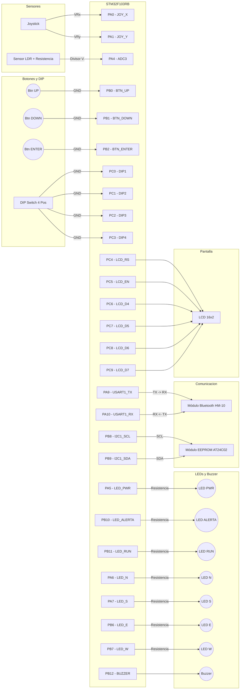

# Diagrama Esquemático de Conexiones - SRAGV

A continuación tenés un diagrama visual interactivo de cómo están conectados todos los componentes a la placa Nucleo. Podés usar esto como una referencia rápida mientras armás tu placa perforada.

> [!NOTE]
> Las conexiones de alimentación (**GND**, **3.3V**, **5V**) fueron omitidas de las líneas de este gráfico para no sobrecargarlo, pero recordá que TODOS los módulos y sensores comparten el mismo **GND**.
